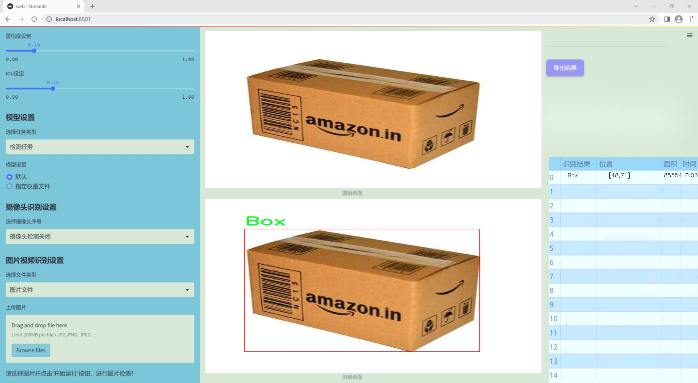
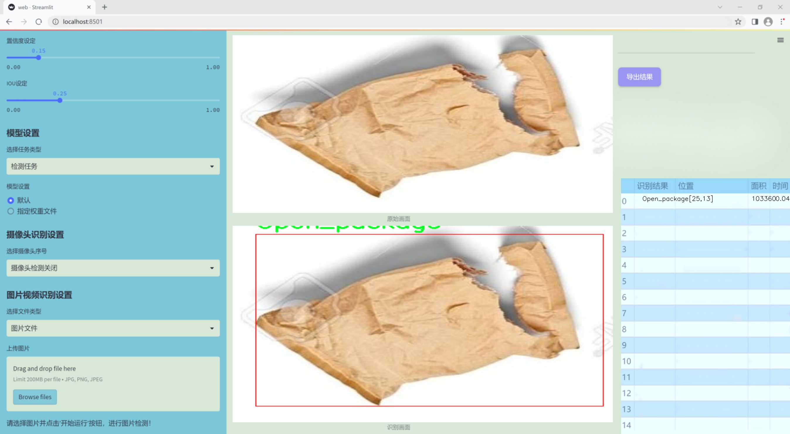
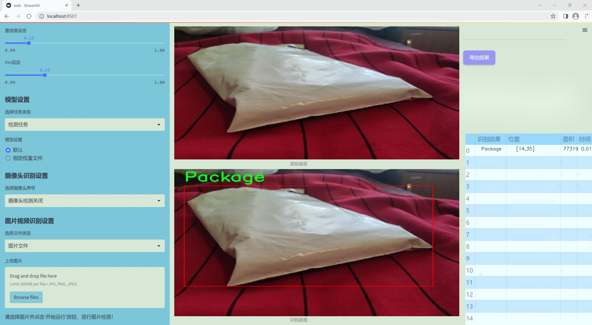
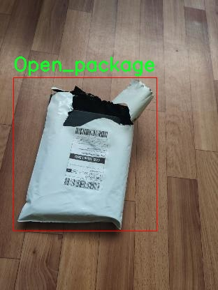
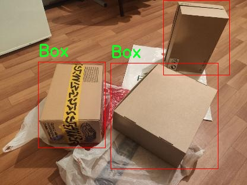
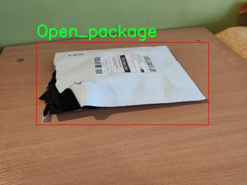
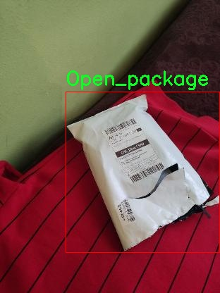
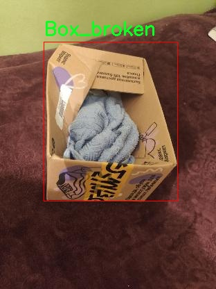

# 改进yolo11-EfficientHead等200+全套创新点大全：快递包装类型检测系统源码＆数据集全套

### 1.图片效果展示







##### 项目来源 **[人工智能促进会 2024.10.24](https://kdocs.cn/l/cszuIiCKVNis)**

注意：由于项目一直在更新迭代，上面“1.图片效果展示”和“2.视频效果展示”展示的系统图片或者视频可能为老版本，新版本在老版本的基础上升级如下：（实际效果以升级的新版本为准）

  （1）适配了YOLOV11的“目标检测”模型和“实例分割”模型，通过加载相应的权重（.pt）文件即可自适应加载模型。

  （2）支持“图片识别”、“视频识别”、“摄像头实时识别”三种识别模式。

  （3）支持“图片识别”、“视频识别”、“摄像头实时识别”三种识别结果保存导出，解决手动导出（容易卡顿出现爆内存）存在的问题，识别完自动保存结果并导出到tempDir中。

  （4）支持Web前端系统中的标题、背景图等自定义修改。

  另外本项目提供训练的数据集和训练教程,暂不提供权重文件（best.pt）,需要您按照教程进行训练后实现图片演示和Web前端界面演示的效果。

### 2.视频效果展示

[2.1 视频效果展示](https://www.bilibili.com/video/BV1cP1YYJEez/)

### 3.背景

研究背景与意义

随着电子商务的迅猛发展，快递行业的业务量不断攀升，快递包装的种类和形态也日益多样化。这一现象不仅给快递物流的管理带来了挑战，也对包装的分类、回收和再利用提出了更高的要求。传统的人工分类方法不仅效率低下，而且容易出现错误，无法满足现代快递行业对快速、准确处理的需求。因此，开发一种高效的自动化快递包装类型检测系统显得尤为重要。

本研究旨在基于改进的YOLOv11模型，构建一个能够准确识别和分类快递包装类型的系统。YOLO（You Only Look Once）系列模型因其快速的检测速度和较高的准确率，已成为目标检测领域的主流方法。通过对YOLOv11的改进，我们期望能够进一步提升其在快递包装检测中的性能，尤其是在处理复杂背景和多样化包装形态时的鲁棒性。

在本项目中，我们使用了包含1200张图像的数据集，涵盖了四种快递包装类型：完整的箱子（Box）、破损的箱子（Box_broken）、打开的包裹（Open_package）以及普通包裹（Package）。这些数据不仅为模型的训练提供了丰富的样本，也为其在实际应用中的推广奠定了基础。通过对这些不同类型的快递包装进行有效的检测与分类，我们希望能够为快递行业的智能化发展提供有力支持。

综上所述，基于改进YOLOv11的快递包装类型检测系统，不仅能够提升快递物流的处理效率，降低人工成本，还能为包装的回收和再利用提供数据支持，推动绿色物流的发展。这一研究不仅具有重要的学术价值，也在实际应用中具有广泛的社会意义。

### 4.数据集信息展示

##### 4.1 本项目数据集详细数据（类别数＆类别名）

nc: 4
names: ['Box', 'Box_broken', 'Open_package', 'Package']


该项目为【目标检测】数据集，请在【训练教程和Web端加载模型教程（第三步）】这一步的时候按照【目标检测】部分的教程来训练

##### 4.2 本项目数据集信息介绍

本项目数据集信息介绍

本项目所使用的数据集名为“Detection_box”，旨在为改进YOLOv11的快递包装类型检测系统提供支持。该数据集专注于快递包装的多样性与复杂性，包含四个主要类别，分别为“Box”、“Box_broken”、“Open_package”和“Package”。这些类别的选择不仅反映了快递行业中常见的包装状态，还涵盖了不同的包装形式，以便于系统能够准确识别和分类各种快递包装情况。

在数据集的构建过程中，我们确保了样本的多样性和代表性。每个类别均包含大量的图像样本，涵盖了不同的拍摄角度、光照条件和背景环境。这种多样性使得模型在训练过程中能够学习到更为丰富的特征，从而提高其在实际应用中的泛化能力。尤其是在“Box_broken”和“Open_package”这两个类别中，我们特别注重收集那些在运输过程中可能出现的损坏或打开状态的包装图像，以增强模型对异常情况的识别能力。

此外，数据集中的图像经过精心标注，确保每个样本的准确性和一致性。这一过程不仅提高了数据集的质量，也为后续的模型训练和评估提供了可靠的基础。通过使用“Detection_box”数据集，我们期望能够有效提升YOLOv11在快递包装类型检测任务中的性能，使其能够在实际应用中更好地服务于快递行业的需求，减少人工干预，提高工作效率。整体而言，本项目的数据集为实现智能化的快递包装检测系统奠定了坚实的基础。











### 5.全套项目环境部署视频教程（零基础手把手教学）

[5.1 所需软件PyCharm和Anaconda安装教程（第一步）](https://www.bilibili.com/video/BV1BoC1YCEKi/?spm_id_from=333.999.0.0&vd_source=bc9aec86d164b67a7004b996143742dc)


[5.2 安装Python虚拟环境创建和依赖库安装视频教程（第二步）](https://www.bilibili.com/video/BV1ZoC1YCEBw?spm_id_from=333.788.videopod.sections&vd_source=bc9aec86d164b67a7004b996143742dc)

### 6.改进YOLOv11训练教程和Web_UI前端加载模型教程（零基础手把手教学）

[6.1 改进YOLOv11训练教程和Web_UI前端加载模型教程（第三步）](https://www.bilibili.com/video/BV1BoC1YCEhR?spm_id_from=333.788.videopod.sections&vd_source=bc9aec86d164b67a7004b996143742dc)


按照上面的训练视频教程链接加载项目提供的数据集，运行train.py即可开始训练



     Epoch   gpu_mem       box       obj       cls    labels  img_size
     1/200     20.8G   0.01576   0.01955  0.007536        22      1280: 100%|██████████| 849/849 [14:42<00:00,  1.04s/it]
               Class     Images     Labels          P          R     mAP@.5 mAP@.5:.95: 100%|██████████| 213/213 [01:14<00:00,  2.87it/s]
                 all       3395      17314      0.994      0.957      0.0957      0.0843

     Epoch   gpu_mem       box       obj       cls    labels  img_size
     2/200     20.8G   0.01578   0.01923  0.007006        22      1280: 100%|██████████| 849/849 [14:44<00:00,  1.04s/it]
               Class     Images     Labels          P          R     mAP@.5 mAP@.5:.95: 100%|██████████| 213/213 [01:12<00:00,  2.95it/s]
                 all       3395      17314      0.996      0.956      0.0957      0.0845

     Epoch   gpu_mem       box       obj       cls    labels  img_size
     3/200     20.8G   0.01561    0.0191  0.006895        27      1280: 100%|██████████| 849/849 [10:56<00:00,  1.29it/s]
               Class     Images     Labels          P          R     mAP@.5 mAP@.5:.95: 100%|███████   | 187/213 [00:52<00:00,  4.04it/s]
                 all       3395      17314      0.996      0.957      0.0957      0.0845


###### [项目数据集下载链接](https://kdocs.cn/l/cszuIiCKVNis)

### 7.原始YOLOv11算法讲解

##### YOLO11简介

> YOLO11源码地址：https://github.com/ultralytics/ultralytics

Ultralytics
YOLO11是一款尖端的、最先进的模型，它在之前YOLO版本成功的基础上进行了构建，并引入了新功能和改进，以进一步提升性能和灵活性。YOLO11设计快速、准确且易于使用，使其成为各种物体检测和跟踪、实例分割、图像分类以及姿态估计任务的绝佳选择。  


**YOLO11创新点如下:**

YOLO 11主要改进包括：  
`增强的特征提取`：YOLO 11采用了改进的骨干和颈部架构，增强了特征提取功能，以实现更精确的目标检测。  
`优化的效率和速度`：优化的架构设计和优化的训练管道提供更快的处理速度，同时保持准确性和性能之间的平衡。  
`更高的精度，更少的参数`：YOLO11m在COCO数据集上实现了更高的平均精度（mAP），参数比YOLOv8m少22%，使其在不影响精度的情况下提高了计算效率。  
`跨环境的适应性`：YOLO 11可以部署在各种环境中，包括边缘设备、云平台和支持NVIDIA GPU的系统。  
`广泛的支持任务`：YOLO 11支持各种计算机视觉任务，如对象检测、实例分割、图像分类、姿态估计和面向对象检测（OBB）。

**YOLO11不同模型尺寸信息：**

YOLO11 提供5种不同的型号规模模型，以满足不同的应用需求：

Model| size (pixels)| mAPval 50-95| Speed CPU ONNX (ms)| Speed T4 TensorRT10
(ms)| params (M)| FLOPs (B)  
---|---|---|---|---|---|---  
YOLO11n| 640| 39.5| 56.1 ± 0.8| 1.5 ± 0.0| 2.6| 6.5  
YOLO11s| 640| 47.0| 90.0 ± 1.2| 2.5 ± 0.0| 9.4| 21.5  
YOLO11m| 640| 51.5| 183.2 ± 2.0| 4.7 ± 0.1| 20.1| 68.0  
YOLO11l| 640| 53.4| 238.6 ± 1.4| 6.2 ± 0.1| 25.3| 86.9  
YOLO11x| 640| 54.7| 462.8 ± 6.7| 11.3 ± 0.2| 56.9| 194.9  
  
**模型常用训练超参数参数说明：**  
`YOLOv11
模型的训练设置包括训练过程中使用的各种超参数和配置`。这些设置会影响模型的性能、速度和准确性。关键的训练设置包括批量大小、学习率、动量和权重衰减。此外，优化器、损失函数和训练数据集组成的选择也会影响训练过程。对这些设置进行仔细的调整和实验对于优化性能至关重要。  
**以下是一些常用的模型训练参数和说明：**

参数名| 默认值| 说明  
---|---|---  
`model`| `None`| 指定用于训练的模型文件。接受指向 `.pt` 预训练模型或 `.yaml`
配置文件。对于定义模型结构或初始化权重至关重要。  
`data`| `None`| 数据集配置文件的路径（例如
`coco8.yaml`).该文件包含特定于数据集的参数，包括训练数据和验证数据的路径、类名和类数。  
`epochs`| `100`| 训练总轮数。每个epoch代表对整个数据集进行一次完整的训练。调整该值会影响训练时间和模型性能。  
`patience`| `100`| 在验证指标没有改善的情况下，提前停止训练所需的epoch数。当性能趋于平稳时停止训练，有助于防止过度拟合。  
`batch`| `16`| 批量大小，有三种模式:设置为整数(例如，’ Batch =16 ‘)， 60% GPU内存利用率的自动模式(’ Batch
=-1 ‘)，或指定利用率分数的自动模式(’ Batch =0.70 ')。  
`imgsz`| `640`| 用于训练的目标图像尺寸。所有图像在输入模型前都会被调整到这一尺寸。影响模型精度和计算复杂度。  
`device`| `None`| 指定用于训练的计算设备：单个 GPU (`device=0`）、多个 GPU (`device=0,1`)、CPU
(`device=cpu`)，或苹果芯片的 MPS (`device=mps`).  
`workers`| `8`| 加载数据的工作线程数（每 `RANK` 多 GPU 训练）。影响数据预处理和输入模型的速度，尤其适用于多 GPU 设置。  
`name`| `None`| 训练运行的名称。用于在项目文件夹内创建一个子目录，用于存储训练日志和输出结果。  
`pretrained`| `True`| 决定是否从预处理模型开始训练。可以是布尔值，也可以是加载权重的特定模型的字符串路径。提高训练效率和模型性能。  
`optimizer`| `'auto'`| 为训练模型选择优化器。选项包括 `SGD`, `Adam`, `AdamW`, `NAdam`,
`RAdam`, `RMSProp` 等，或 `auto` 用于根据模型配置进行自动选择。影响收敛速度和稳定性  
`lr0`| `0.01`| 初始学习率（即 `SGD=1E-2`, `Adam=1E-3`) .调整这个值对优化过程至关重要，会影响模型权重的更新速度。  
`lrf`| `0.01`| 最终学习率占初始学习率的百分比 = (`lr0 * lrf`)，与调度程序结合使用，随着时间的推移调整学习率。  


**各损失函数作用说明：**  
`定位损失box_loss`：预测框与标定框之间的误差（GIoU），越小定位得越准；  
`分类损失cls_loss`：计算锚框与对应的标定分类是否正确，越小分类得越准；  
`动态特征损失（dfl_loss）`：DFLLoss是一种用于回归预测框与目标框之间距离的损失函数。在计算损失时，目标框需要缩放到特征图尺度，即除以相应的stride，并与预测的边界框计算Ciou
Loss，同时与预测的anchors中心点到各边的距离计算回归DFLLoss。  


### 8.200+种全套改进YOLOV11创新点原理讲解

#### 8.1 200+种全套改进YOLOV11创新点原理讲解大全

由于篇幅限制，每个创新点的具体原理讲解就不全部展开，具体见下列网址中的改进模块对应项目的技术原理博客网址【Blog】（创新点均为模块化搭建，原理适配YOLOv5~YOLOv11等各种版本）

[改进模块技术原理博客【Blog】网址链接](https://gitee.com/qunmasj/good)


#### 8.2 精选部分改进YOLOV11创新点原理讲解

###### 这里节选部分改进创新点展开原理讲解(完整的改进原理见上图和[改进模块技术原理博客链接](https://gitee.com/qunmasj/good)【如果此小节的图加载失败可以通过CSDN或者Github搜索该博客的标题访问原始博客，原始博客图片显示正常】
### CBAM空间注意力机制
近年来，随着深度学习研究方向的火热，注意力机制也被广泛地应用在图像识别、语音识别和自然语言处理等领域，注意力机制在深度学习任务中发挥着举足轻重的作用。注意力机制借鉴于人类的视觉系统，例如，人眼在看到一幅画面时，会倾向于关注画面中的重要信息，而忽略其他可见的信息。深度学习中的注意力机制和人类视觉的注意力机制相似，通过扫描全局数据，从大量数据中选择出需要重点关注的、对当前任务更为重要的信息，然后对这部分信息分配更多的注意力资源，从这些信息中获取更多所需要的细节信息，而抑制其他无用的信息。而在深度学习中，则具体表现为给感兴趣的区域更高的权重，经过网络的学习和调整，得到最优的权重分配，形成网络模型的注意力，使网络拥有更强的学习能力，加快网络的收敛速度。
注意力机制通常可分为软注意力机制和硬注意力机制[4-5]。软注意力机制在选择信息时，不是从输入的信息中只选择1个，而会用到所有输入信息，只是各个信息对应的权重分配不同，然后输入网络模型进行计算;硬注意力机制则是从输入的信息中随机选取一个或者选择概率最高的信息，但是这一步骤通常是不可微的，导致硬注意力机制更难训练。因此，软注意力机制应用更为广泛，按照原理可将软注意力机制划分为:通道注意力机制（channel attention)、空间注意力机制(spatial attention）和混合域注意力机制(mixed attention)。
通道注意力机制的本质建立各个特征通道之间的重要程度，对感兴趣的通道进行重点关注，弱化不感兴趣的通道的作用;空间注意力的本质则是建模了整个空间信息的重要程度，然后对空间内感兴趣的区域进行重点关注，弱化其余非感兴趣区域的作用;混合注意力同时运用了通道注意力和空间注意力，两部分先后进行或并行，形成对通道特征和空间特征同时关注的注意力模型。

卷积层注意力模块(Convolutional Block Attention Module，CBAM）是比较常用的混合注意力模块，其先后集中了通道注意力模块和空间注意力模块，网络中加入该模块能有效提高网络性能，减少网络模型的计算量，模块结构如图所示。输入特征图首先经过分支的通道注意力模块，然后和主干的原特征图融合，得到具有通道注意力的特征图，接着经过分支的空间注意力模块，在和主干的特征图融合后，得到同时具有通道特征注意力和空间特征注意力的特征图。CBAM模块不改变输入特征图的大小，因此该模块是一个“即插即用”的模块，可以插入网络的任何位置。

通道注意力模块的结构示意图如图所示，通道注意力模块分支并行地对输入的特征图进行最大池化操作和平均池化操作，然后利用多层感知机对结果进行变换，得到应用于两个通道的变换结果，最后经过sigmoid激活函数将变换结果融合，得到具有通道注意力的通道特征图。

空间注意力模块示意图如图所示，将通道注意力模块输出的特征图作为该模块的输入特征图，首先对输入特征图进行基于通道的最大池化操作和平均池化操作，将两部分得到的结果拼接起来，然后通过卷积得到降为Ⅰ通道的特征图，最后通过sigmoid激活函数生成具有空间注意力的特征图。


### 9.系统功能展示

图9.1.系统支持检测结果表格显示

  图9.2.系统支持置信度和IOU阈值手动调节

  图9.3.系统支持自定义加载权重文件best.pt(需要你通过步骤5中训练获得)

  图9.4.系统支持摄像头实时识别

  图9.5.系统支持图片识别

  图9.6.系统支持视频识别

  图9.7.系统支持识别结果文件自动保存

  图9.8.系统支持Excel导出检测结果数据


### 10. YOLOv11核心改进源码讲解

#### 10.1 UniRepLKNet.py

以下是对给定代码的核心部分进行提炼和详细注释的结果。主要保留了模型的核心结构和重要功能，去掉了一些冗余的部分。

```python
import torch
import torch.nn as nn
import torch.nn.functional as F
from timm.layers import trunc_normal_, DropPath, to_2tuple

class GRNwithNHWC(nn.Module):
    """ GRN (Global Response Normalization) 层
    该层用于对输入进行全局响应归一化。
    输入假设为 (N, H, W, C) 格式。
    """
    def __init__(self, dim, use_bias=True):
        super().__init__()
        self.use_bias = use_bias
        self.gamma = nn.Parameter(torch.zeros(1, 1, 1, dim))  # 可学习参数
        if self.use_bias:
            self.beta = nn.Parameter(torch.zeros(1, 1, 1, dim))  # 可学习偏置

    def forward(self, x):
        Gx = torch.norm(x, p=2, dim=(1, 2), keepdim=True)  # 计算L2范数
        Nx = Gx / (Gx.mean(dim=-1, keepdim=True) + 1e-6)  # 归一化
        if self.use_bias:
            return (self.gamma * Nx + 1) * x + self.beta  # 应用归一化和偏置
        else:
            return (self.gamma * Nx + 1) * x

class DilatedReparamBlock(nn.Module):
    """ Dilated Reparam Block
    该模块用于实现扩张卷积的重参数化。
    输入假设为 (N, C, H, W) 格式。
    """
    def __init__(self, channels, kernel_size, deploy, use_sync_bn=False):
        super().__init__()
        self.lk_origin = nn.Conv2d(channels, channels, kernel_size=kernel_size, stride=1,
                                    padding=kernel_size//2, dilation=1, groups=channels, bias=True)
        self.attempt_use_lk_impl = True  # 是否尝试使用高效的卷积实现

        # 定义扩张卷积的参数
        self.kernel_sizes = [3, 5]  # 示例：可根据需要调整
        self.dilates = [1, 2]  # 示例：可根据需要调整

        if not deploy:
            self.origin_bn = nn.BatchNorm2d(channels)  # 训练模式下使用BatchNorm
            for k, r in zip(self.kernel_sizes, self.dilates):
                self.__setattr__('dil_conv_k{}_{}'.format(k, r),
                                 nn.Conv2d(channels, channels, kernel_size=k, stride=1,
                                           padding=(r * (k - 1) + 1) // 2, dilation=r, groups=channels,
                                           bias=False))
                self.__setattr__('dil_bn_k{}_{}'.format(k, r), nn.BatchNorm2d(channels))

    def forward(self, x):
        if not hasattr(self, 'origin_bn'):  # 部署模式
            return self.lk_origin(x)
        out = self.origin_bn(self.lk_origin(x))  # 应用原始卷积和BN
        for k, r in zip(self.kernel_sizes, self.dilates):
            conv = self.__getattr__('dil_conv_k{}_{}'.format(k, r))
            bn = self.__getattr__('dil_bn_k{}_{}'.format(k, r))
            out = out + bn(conv(x))  # 添加扩张卷积的输出
        return out

class UniRepLKNetBlock(nn.Module):
    """ UniRepLKNet中的基本块
    包含卷积、归一化、激活和Squeeze-and-Excitation模块。
    """
    def __init__(self, dim, kernel_size, drop_path=0., deploy=False):
        super().__init__()
        self.dwconv = DilatedReparamBlock(dim, kernel_size, deploy=deploy)  # 扩张卷积
        self.norm = nn.BatchNorm2d(dim)  # 归一化层
        self.se = SEBlock(dim, dim // 4)  # Squeeze-and-Excitation模块

        ffn_dim = dim * 4  # 前馈网络维度
        self.pwconv1 = nn.Linear(dim, ffn_dim)  # 第一层前馈网络
        self.act = nn.GELU()  # 激活函数
        self.pwconv2 = nn.Linear(ffn_dim, dim)  # 第二层前馈网络

    def forward(self, inputs):
        y = self.se(self.norm(self.dwconv(inputs)))  # 通过扩张卷积和SE模块
        y = self.pwconv2(self.act(self.pwconv1(y)))  # 前馈网络
        return y + inputs  # 残差连接

class UniRepLKNet(nn.Module):
    """ UniRepLKNet模型
    包含多个UniRepLKNetBlock，构成深度神经网络。
    """
    def __init__(self, in_chans=3, num_classes=1000, depths=(3, 3, 27, 3), dims=(96, 192, 384, 768)):
        super().__init__()
        self.stages = nn.ModuleList()  # 存储不同阶段的模块
        for i in range(4):
            stage = nn.Sequential(
                *[UniRepLKNetBlock(dim=dims[i], kernel_size=3) for _ in range(depths[i])]
            )
            self.stages.append(stage)

    def forward(self, x):
        for stage in self.stages:
            x = stage(x)  # 逐阶段传递输入
        return x

# 示例模型创建和前向传播
if __name__ == '__main__':
    inputs = torch.randn((1, 3, 640, 640))  # 随机输入
    model = UniRepLKNet()  # 创建模型
    res = model(inputs)  # 前向传播
    print(res.shape)  # 输出结果形状
```

### 代码核心部分说明：
1. **GRNwithNHWC**: 实现了全局响应归一化层，用于对输入进行归一化处理。
2. **DilatedReparamBlock**: 实现了扩张卷积的重参数化，包含多个扩张卷积和BatchNorm层。
3. **UniRepLKNetBlock**: 该模块是UniRepLKNet的基本构建块，包含扩张卷积、归一化、激活和Squeeze-and-Excitation模块。
4. **UniRepLKNet**: 整个模型的实现，包含多个阶段，每个阶段由多个UniRepLKNetBlock组成。

以上代码经过简化，保留了核心功能和结构，并添加了详细的中文注释以帮助理解。

该文件实现了一个名为UniRepLKNet的深度学习模型，主要用于音频、视频、点云、时间序列和图像识别等任务。该模型的设计灵感来源于多个前沿的卷积神经网络架构，包括RepLKNet、ConvNeXt、DINO和DeiT等。文件中包含了一系列的类和函数，构成了模型的基础结构。

首先，文件导入了必要的PyTorch库以及一些辅助函数和模块。接着，定义了多个模块，包括GRN（全局响应归一化）层、NCHW与NHWC格式的转换层、Squeeze-and-Excitation（SE）块等。这些模块的设计旨在提高模型的表达能力和计算效率。

GRN层通过对输入进行归一化处理，增强了模型对特征的响应能力。NCHWtoNHWC和NHWCtoNCHW类则负责在不同的数据格式之间进行转换，以适应不同的卷积实现。SE块通过自适应地调整通道的权重，进一步提升了特征的表达能力。

文件中还定义了一个函数`get_conv2d`，用于根据输入参数选择合适的卷积实现，支持原生卷积和iGEMM大核卷积的选择。该函数会根据卷积的特性（如核大小、步幅、填充等）决定使用哪种实现方式。

在`DilatedReparamBlock`类中，定义了一个带有扩张卷积的重参数化块，该块通过多个不同核大小和扩张率的卷积层组合，增强了模型对不同尺度特征的捕捉能力。`UniRepLKNetBlock`类则是模型的基本构建单元，结合了卷积、归一化、激活和SE块，形成了一个完整的模块。

`UniRepLKNet`类是整个模型的核心，负责构建模型的不同阶段，包括下采样层和多个UniRepLKNetBlock。模型的输入通道数、类别数、每个阶段的深度和特征维度等都可以通过参数进行配置。模型还支持部署模式和检查点功能，以便在训练和推理时灵活使用。

最后，文件提供了一些函数（如`unireplknet_a`、`unireplknet_f`等）用于实例化不同配置的UniRepLKNet模型，并加载预训练权重。主函数部分则展示了如何创建模型实例并进行推理。

总体而言，该文件实现了一个灵活且高效的卷积神经网络架构，适用于多种视觉和音频任务，具有良好的扩展性和可配置性。

#### 10.2 shiftwise_conv.py

以下是代码中最核心的部分，并附上详细的中文注释：

```python
import math
import torch
import torch.nn as nn
import torch.nn.functional as F

def get_conv2d(in_channels, out_channels, kernel_size, stride, padding, dilation, groups, bias):
    # 创建一个2D卷积层
    return nn.Conv2d(
        in_channels, out_channels, kernel_size, stride, padding, dilation, groups, bias
    )

def get_bn(channels):
    # 创建一个批归一化层
    return nn.BatchNorm2d(channels)

class Mask(nn.Module):
    def __init__(self, size):
        super().__init__()
        # 初始化权重参数，范围在-1到1之间
        self.weight = torch.nn.Parameter(data=torch.Tensor(*size), requires_grad=True)
        self.weight.data.uniform_(-1, 1)

    def forward(self, x):
        # 使用sigmoid函数对权重进行激活
        w = torch.sigmoid(self.weight)
        # 将输入x与权重w相乘，进行掩码操作
        masked_wt = w.mul(x)
        return masked_wt

class LoRAConvsByWeight(nn.Module):
    def __init__(self, in_channels, out_channels, big_kernel, small_kernel, stride=1, group=1, bn=True, use_small_conv=True):
        super().__init__()
        self.kernels = (small_kernel, big_kernel)  # 小卷积核和大卷积核
        self.stride = stride
        self.small_conv = use_small_conv
        # 计算填充和索引
        padding, after_padding_index, index = self.shift(self.kernels)
        self.pad = padding, after_padding_index, index
        self.nk = math.ceil(big_kernel / small_kernel)  # 计算小卷积核的数量
        out_n = out_channels * self.nk  # 输出通道数
        # 创建分离卷积层
        self.split_convs = nn.Conv2d(in_channels, out_n, kernel_size=small_kernel, stride=stride, padding=padding, groups=group, bias=False)

        # 创建两个掩码层
        self.lora1 = Mask((1, out_n, 1, 1))
        self.lora2 = Mask((1, out_n, 1, 1))
        self.use_bn = bn

        # 如果需要，创建批归一化层
        if bn:
            self.bn_lora1 = get_bn(out_channels)
            self.bn_lora2 = get_bn(out_channels)
        else:
            self.bn_lora1 = None
            self.bn_lora2 = None

    def forward(self, inputs):
        # 前向传播
        out = self.split_convs(inputs)  # 通过分离卷积层
        *_, ori_h, ori_w = inputs.shape  # 获取输入的高度和宽度
        # 分别通过两个掩码层
        lora1_x = self.forward_lora(self.lora1(out), ori_h, ori_w, VH='H', bn=self.bn_lora1)
        lora2_x = self.forward_lora(self.lora2(out), ori_h, ori_w, VH='W', bn=self.bn_lora2)
        x = lora1_x + lora2_x  # 合并结果
        return x

    def forward_lora(self, out, ori_h, ori_w, VH='H', bn=None):
        # 处理输出，按组进行数据重排
        b, c, h, w = out.shape
        out = torch.split(out.reshape(b, -1, self.nk, h, w), 1, 2)  # 将输出按组分割
        x = 0
        for i in range(self.nk):
            outi = self.rearrange_data(out[i], i, ori_h, ori_w, VH)  # 重排数据
            x = x + outi  # 累加结果
        if self.use_bn:
            x = bn(x)  # 如果需要，进行批归一化
        return x

    def rearrange_data(self, x, idx, ori_h, ori_w, VH):
        # 根据索引重排数据
        padding, _, index = self.pad
        x = x.squeeze(2)  # 去掉维度
        *_, h, w = x.shape
        k = min(self.kernels)
        ori_k = max(self.kernels)
        ori_p = ori_k // 2
        stride = self.stride
        # 计算填充和起始点
        if (idx + 1) >= index:
            pad_l = 0
            s = (idx + 1 - index) * (k // stride)
        else:
            pad_l = (index - 1 - idx) * (k // stride)
            s = 0
        if VH == 'H':
            suppose_len = (ori_w + 2 * ori_p - ori_k) // stride + 1
            pad_r = 0 if (s + suppose_len) <= (w + pad_l) else s + suppose_len - w - pad_l
            new_pad = (pad_l, pad_r, 0, 0)
            dim = 3
        else:
            suppose_len = (ori_h + 2 * ori_p - ori_k) // stride + 1
            pad_r = 0 if (s + suppose_len) <= (h + pad_l) else s + suppose_len - h - pad_l
            new_pad = (0, 0, pad_l, pad_r)
            dim = 2
        if len(set(new_pad)) > 1:
            x = F.pad(x, new_pad)  # 填充
        if padding * 2 + 1 != k:
            pad = padding - k // 2
            if VH == 'H':
                x = torch.narrow(x, 2, pad, h - 2 * pad)
            else:
                x = torch.narrow(x, 3, pad, w - 2 * pad)

        xs = torch.narrow(x, dim, s, suppose_len)  # 根据维度切片
        return xs

    def shift(self, kernels):
        # 计算填充和索引
        mink, maxk = min(kernels), max(kernels)
        mid_p = maxk // 2
        offset_idx_left = mid_p % mink
        offset_idx_right = (math.ceil(maxk / mink) * mink - mid_p - 1) % mink
        padding = offset_idx_left % mink
        while padding < offset_idx_right:
            padding += mink
        while padding < (mink - 1):
            padding += mink
        after_padding_index = padding - offset_idx_left
        index = math.ceil((mid_p + 1) / mink)
        real_start_idx = index - after_padding_index // mink
        return padding, after_padding_index, real_start_idx

class ReparamLargeKernelConv(nn.Module):
    def __init__(self, in_channels, out_channels, kernel_size, small_kernel=5, stride=1, groups=1, small_kernel_merged=False, Decom=True, bn=True):
        super(ReparamLargeKernelConv, self).__init__()
        self.kernel_size = kernel_size
        self.small_kernel = small_kernel
        self.Decom = Decom
        padding = kernel_size // 2  # 填充
        if small_kernel_merged:
            self.lkb_reparam = get_conv2d(in_channels, out_channels, kernel_size, stride, padding, 1, groups, True)
        else:
            if self.Decom:
                self.LoRA = conv_bn(in_channels, out_channels, (kernel_size, small_kernel), stride, padding, 1, bn=bn)
            else:
                self.lkb_origin = conv_bn(in_channels, out_channels, kernel_size, stride, padding, 1, bn=bn)

            if (small_kernel is not None) and small_kernel < kernel_size:
                self.small_conv = conv_bn(in_channels, out_channels, small_kernel, stride, small_kernel // 2, groups, bn=bn)

        self.bn = get_bn(out_channels)  # 批归一化
        self.act = nn.SiLU()  # 激活函数

    def forward(self, inputs):
        # 前向传播
        if hasattr(self, "lkb_reparam"):
            out = self.lkb_reparam(inputs)
        elif self.Decom:
            out = self.LoRA(inputs)
            if hasattr(self, "small_conv"):
                out += self.small_conv(inputs)
        else:
            out = self.lkb_origin(inputs)
            if hasattr(self, "small_conv"):
                out += self.small_conv(inputs)
        return self.act(self.bn(out))  # 激活和归一化

    def get_equivalent_kernel_bias(self):
        # 获取等效的卷积核和偏置
        eq_k, eq_b = fuse_bn(self.lkb_origin.conv, self.lkb_origin.bn)
        if hasattr(self, "small_conv"):
            small_k, small_b = fuse_bn(self.small_conv.conv, self.small_conv.bn)
            eq_b += small_b
            eq_k += nn.functional.pad(small_k, [(self.kernel_size - self.small_kernel) // 2] * 4)
        return eq_k, eq_b

    def switch_to_deploy(self):
        # 切换到部署模式
        if hasattr(self, 'lkb_origin'):
            eq_k, eq_b = self.get_equivalent_kernel_bias()
            self.lkb_reparam = get_conv2d(self.lkb_origin.conv.in_channels, self.lkb_origin.conv.out_channels, self.lkb_origin.conv.kernel_size, self.lkb_origin.conv.stride, self.lkb_origin.conv.padding, self.lkb_origin.conv.dilation, self.lkb_origin.conv.groups, True)
            self.lkb_reparam.weight.data = eq_k
            self.lkb_reparam.bias.data = eq_b
            self.__delattr__("lkb_origin")
            if hasattr(self, "small_conv"):
                self.__delattr__("small_conv")
```

### 代码说明：
1. **卷积层和批归一化层的创建**：`get_conv2d`和`get_bn`函数用于创建卷积层和批归一化层。
2. **掩码类**：`Mask`类用于创建一个可学习的掩码，通过sigmoid激活来调整输入特征。
3. **LoRA卷积**：`LoRAConvsByWeight`类实现了LoRA（Low-Rank Adaptation）卷积，通过两个掩码和分离卷积层进行特征处理。
4. **重参数化卷积**：`ReparamLargeKernelConv`类实现了重参数化的大卷积核，通过组合小卷积核和大卷积核来提高计算效率。
5. **前向传播**：每个类都有`forward`方法来定义数据的前向传播过程。
6. **等效卷积核和偏置的获取**：`get_equivalent_kernel_bias`方法用于获取经过批归一化后的等效卷积核和偏置。
7. **切换到部署模式**：`switch_to_deploy`方法用于将模型切换到部署模式，优化计算效率。

这个程序文件 `shiftwise_conv.py` 实现了一个自定义的卷积层，主要用于处理大卷积核和小卷积核的组合。代码中使用了 PyTorch 框架，定义了一些辅助函数和类，以便于构建和使用这些卷积层。

首先，文件中导入了必要的库，包括 `math` 和 `torch` 以及 PyTorch 的神经网络模块 `torch.nn` 和功能模块 `torch.nn.functional`。接着，定义了一个函数 `get_conv2d`，用于创建一个标准的二维卷积层，允许指定输入和输出通道数、卷积核大小、步幅、填充、扩张率、分组和是否使用偏置等参数。

`get_bn` 函数用于创建一个批归一化层，接受通道数作为参数。

接下来，定义了一个 `Mask` 类，它是一个可学习的参数，使用 sigmoid 函数对其进行激活，并与输入进行逐元素相乘，产生一个掩码效果。

`conv_bn_ori` 函数构建一个包含卷积层和可选的批归一化层的序列模型。这个函数会根据输入参数创建相应的卷积层，并在需要时添加批归一化层。

`LoRAConvsByWeight` 类实现了一个特殊的卷积结构，旨在通过权重合并不同的卷积核。它的构造函数接收多个参数，包括输入和输出通道数、卷积核大小、步幅、分组等。该类的 `forward` 方法会执行卷积操作，并通过 `forward_lora` 方法对输出进行处理，使用掩码和重排数据的方式来实现卷积的效果。

`rearrange_data` 方法用于根据输入的参数调整数据的形状和填充，以便在不同的方向上进行卷积操作。`shift` 方法则计算卷积操作所需的填充和索引，以确保特征图的大小不变。

`conv_bn` 函数根据卷积核的大小选择使用 `conv_bn_ori` 或 `LoRAConvsByWeight` 进行卷积操作。

`fuse_bn` 函数用于将卷积层和批归一化层合并为一个等效的卷积层，以便在推理时提高效率。

最后，`ReparamLargeKernelConv` 类是整个文件的核心，负责实现大卷积核的重参数化。它的构造函数根据输入参数设置卷积层、批归一化层和激活函数。`forward` 方法执行前向传播，返回经过激活的输出。`get_equivalent_kernel_bias` 方法用于获取等效的卷积核和偏置，而 `switch_to_deploy` 方法则将模型切换到推理模式，合并卷积和批归一化层。

整体来看，这个文件实现了一个灵活且高效的卷积层设计，能够处理不同大小的卷积核，并通过重参数化技术提高模型的推理性能。

#### 10.3 lsknet.py

以下是经过简化并注释的核心代码部分：

```python
import torch
import torch.nn as nn
from functools import partial

class Mlp(nn.Module):
    """ 多层感知机模块 """
    def __init__(self, in_features, hidden_features=None, out_features=None, act_layer=nn.GELU, drop=0.):
        super().__init__()
        out_features = out_features or in_features  # 输出特征数默认为输入特征数
        hidden_features = hidden_features or in_features  # 隐藏层特征数默认为输入特征数
        self.fc1 = nn.Conv2d(in_features, hidden_features, 1)  # 1x1卷积层
        self.dwconv = DWConv(hidden_features)  # 深度卷积层
        self.act = act_layer()  # 激活函数
        self.fc2 = nn.Conv2d(hidden_features, out_features, 1)  # 1x1卷积层
        self.drop = nn.Dropout(drop)  # Dropout层

    def forward(self, x):
        """ 前向传播 """
        x = self.fc1(x)
        x = self.dwconv(x)
        x = self.act(x)
        x = self.drop(x)
        x = self.fc2(x)
        x = self.drop(x)
        return x


class Attention(nn.Module):
    """ 注意力模块 """
    def __init__(self, d_model):
        super().__init__()
        self.proj_1 = nn.Conv2d(d_model, d_model, 1)  # 1x1卷积
        self.activation = nn.GELU()  # 激活函数
        self.spatial_gating_unit = LSKblock(d_model)  # 空间门控单元
        self.proj_2 = nn.Conv2d(d_model, d_model, 1)  # 1x1卷积

    def forward(self, x):
        """ 前向传播 """
        shortcut = x.clone()  # 保留输入用于残差连接
        x = self.proj_1(x)
        x = self.activation(x)
        x = self.spatial_gating_unit(x)
        x = self.proj_2(x)
        x = x + shortcut  # 残差连接
        return x


class Block(nn.Module):
    """ 基本块，包括注意力和多层感知机 """
    def __init__(self, dim, mlp_ratio=4., drop=0., drop_path=0., act_layer=nn.GELU):
        super().__init__()
        self.norm1 = nn.BatchNorm2d(dim)  # 批归一化
        self.norm2 = nn.BatchNorm2d(dim)  # 批归一化
        self.attn = Attention(dim)  # 注意力模块
        self.mlp = Mlp(in_features=dim, hidden_features=int(dim * mlp_ratio), act_layer=act_layer, drop=drop)  # 多层感知机

    def forward(self, x):
        """ 前向传播 """
        x = x + self.attn(self.norm1(x))  # 添加注意力模块的输出
        x = x + self.mlp(self.norm2(x))  # 添加多层感知机的输出
        return x


class LSKNet(nn.Module):
    """ LSKNet网络结构 """
    def __init__(self, img_size=224, in_chans=3, embed_dims=[64, 128, 256, 512], depths=[3, 4, 6, 3]):
        super().__init__()
        self.num_stages = len(embed_dims)  # 网络阶段数
        for i in range(self.num_stages):
            # 初始化每个阶段的嵌入和块
            patch_embed = OverlapPatchEmbed(img_size=img_size // (2 ** i), in_chans=in_chans if i == 0 else embed_dims[i - 1], embed_dim=embed_dims[i])
            block = nn.ModuleList([Block(dim=embed_dims[i]) for _ in range(depths[i])])
            setattr(self, f"patch_embed{i + 1}", patch_embed)
            setattr(self, f"block{i + 1}", block)

    def forward(self, x):
        """ 前向传播 """
        outs = []
        for i in range(self.num_stages):
            patch_embed = getattr(self, f"patch_embed{i + 1}")
            block = getattr(self, f"block{i + 1}")
            x, _, _ = patch_embed(x)  # 嵌入
            for blk in block:
                x = blk(x)  # 通过块
            outs.append(x)  # 收集输出
        return outs


class DWConv(nn.Module):
    """ 深度卷积模块 """
    def __init__(self, dim=768):
        super(DWConv, self).__init__()
        self.dwconv = nn.Conv2d(dim, dim, 3, 1, 1, bias=True, groups=dim)  # 深度卷积

    def forward(self, x):
        """ 前向传播 """
        return self.dwconv(x)


def lsknet_t():
    """ 创建LSKNet的一个变体 """
    return LSKNet(embed_dims=[32, 64, 160, 256], depths=[3, 3, 5, 2])

if __name__ == '__main__':
    model = lsknet_t()  # 实例化模型
    inputs = torch.randn((1, 3, 640, 640))  # 创建随机输入
    for i in model(inputs):
        print(i.size())  # 输出每个阶段的输出尺寸
```

### 代码说明：
1. **Mlp类**：实现了一个多层感知机，包含两个1x1卷积层和一个深度卷积层，使用GELU激活函数和Dropout。
2. **Attention类**：实现了一个注意力机制，包含两个1x1卷积和一个空间门控单元（LSKblock）。
3. **Block类**：将注意力和多层感知机结合在一起，形成一个基本的网络块。
4. **LSKNet类**：构建整个网络结构，包含多个阶段，每个阶段有嵌入层和多个块。
5. **DWConv类**：实现了深度卷积操作。
6. **lsknet_t函数**：用于创建LSKNet的一个特定变体。
7. **主程序**：实例化模型并测试输入的输出尺寸。

这个程序文件 `lsknet.py` 实现了一个名为 LSKNet 的深度学习模型，主要用于图像处理任务。该模型基于 PyTorch 框架构建，包含多个模块和类，具体功能如下：

首先，导入了必要的库，包括 PyTorch、神经网络模块、一些实用工具以及 NumPy。然后，定义了一个 Mlp 类，这是一个多层感知机，包含两个卷积层和一个深度卷积层，使用 GELU 激活函数，并且支持 dropout。

接下来，定义了 LSKblock 类，它是模型的核心部分之一。该类通过多个卷积操作提取特征，并使用注意力机制来增强特征表示。它首先通过深度卷积和空间卷积生成特征，然后通过 squeeze 操作和 sigmoid 激活函数生成注意力权重，最后将加权特征与输入特征相乘。

Attention 类则实现了一个简单的注意力机制，包含两个卷积层和一个 LSKblock。它通过残差连接将输入与经过处理的特征相加，增强了模型的学习能力。

Block 类结合了归一化、注意力机制和多层感知机。它通过残差连接和层级缩放来增强模型的稳定性和性能。

OverlapPatchEmbed 类负责将输入图像分割成重叠的补丁，并进行嵌入。它使用卷积层将图像转换为特征图，并进行归一化处理。

LSKNet 类是整个模型的主体，包含多个阶段，每个阶段由补丁嵌入、多个 Block 和归一化层组成。模型的深度和嵌入维度可以通过参数进行调整。

DWConv 类实现了深度卷积，用于特征提取。

update_weight 函数用于更新模型的权重，确保加载的权重与模型的结构匹配。

lsknet_t 和 lsknet_s 函数分别创建了不同配置的 LSKNet 模型，并可选择加载预训练权重。

最后，在主程序中，创建了一个 LSKNet 模型实例，并对一个随机生成的输入进行前向传播，输出每个阶段的特征图的尺寸。

整体来看，这个程序实现了一个灵活且高效的图像处理模型，适用于各种计算机视觉任务。

#### 10.4 ui.py

```python
import sys
import subprocess

def run_script(script_path):
    """
    使用当前 Python 环境运行指定的脚本。

    Args:
        script_path (str): 要运行的脚本路径

    Returns:
        None
    """
    # 获取当前 Python 解释器的路径
    python_path = sys.executable

    # 构建运行命令，使用 streamlit 运行指定的脚本
    command = f'"{python_path}" -m streamlit run "{script_path}"'

    # 执行命令并等待其完成
    result = subprocess.run(command, shell=True)
    
    # 检查命令执行的返回码，如果不为0则表示出错
    if result.returncode != 0:
        print("脚本运行出错。")


# 主程序入口
if __name__ == "__main__":
    # 指定要运行的脚本路径
    script_path = "web.py"  # 这里可以直接指定脚本名，假设在当前目录下

    # 调用函数运行脚本
    run_script(script_path)
```

### 代码注释说明：
1. **导入模块**：
   - `sys`：用于获取当前 Python 解释器的路径。
   - `subprocess`：用于执行外部命令。

2. **`run_script` 函数**：
   - 功能：运行指定路径的 Python 脚本。
   - 参数：`script_path`，需要运行的脚本的路径。
   - 获取当前 Python 解释器的路径，构建命令字符串，使用 `subprocess.run` 执行命令。
   - 检查命令执行的返回码，如果返回码不为0，表示脚本运行出错，打印错误信息。

3. **主程序入口**：
   - 使用 `if __name__ == "__main__":` 确保只有在直接运行该脚本时才会执行以下代码。
   - 指定要运行的脚本路径（这里假设脚本名为 `web.py`）。
   - 调用 `run_script` 函数，传入脚本路径以执行该脚本。

这个程序文件的主要功能是使用当前的 Python 环境来运行一个指定的脚本，具体是一个名为 `web.py` 的文件。程序首先导入了必要的模块，包括 `sys`、`os` 和 `subprocess`，这些模块提供了与系统交互的功能。

在 `run_script` 函数中，首先获取当前 Python 解释器的路径，这通过 `sys.executable` 实现。接着，构建一个命令字符串，该命令使用 `streamlit` 模块来运行指定的脚本。`streamlit` 是一个用于构建数据应用的库，这里通过 `-m` 参数来指定模块运行。

随后，使用 `subprocess.run` 方法执行构建好的命令。这个方法会在新的 shell 中运行命令，并等待其完成。如果命令执行后返回的状态码不为零，表示脚本运行出错，程序会输出相应的错误信息。

在文件的最后部分，使用 `if __name__ == "__main__":` 语句来确保只有在直接运行该文件时才会执行下面的代码。这里指定了要运行的脚本路径，即 `web.py`，并调用 `run_script` 函数来执行该脚本。

总的来说，这个程序提供了一种简便的方式来启动一个基于 Streamlit 的 web 应用，通过指定脚本路径并在当前 Python 环境中运行它。

注意：由于此博客编辑较早，上面“10.YOLOv11核心改进源码讲解”中部分代码可能会优化升级，仅供参考学习，以“11.完整训练+Web前端界面+200+种全套创新点源码、数据集获取”的内容为准。

### 11.完整训练+Web前端界面+200+种全套创新点源码、数据集获取


# [下载链接：https://mbd.pub/o/bread/Zp6WmZZr](https://mbd.pub/o/bread/Zp6WmZZr)